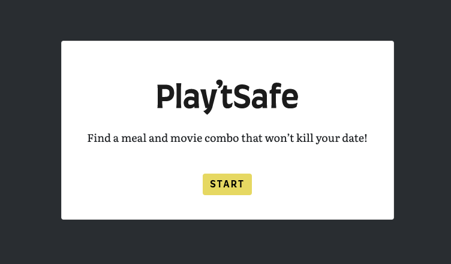
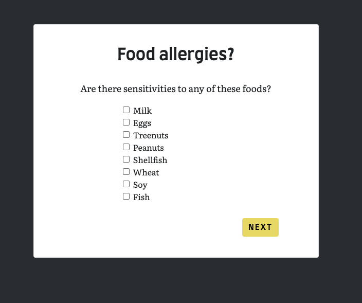
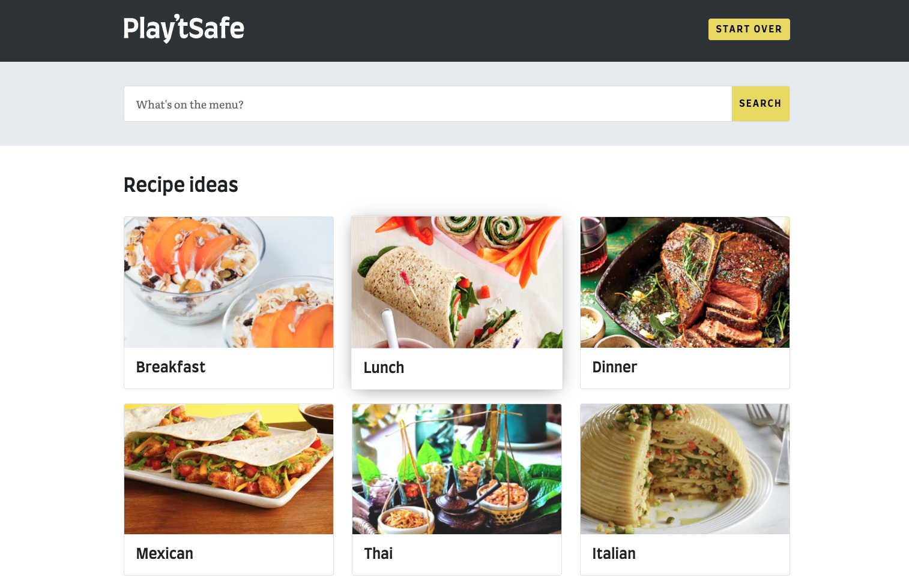

# Project-1

## Table of Contents

* [Description](#description)
* [Screenshot](#screenshot)
* [URL](#url)
* [Contributions](#contributions)
* [License](#license)

## __Description__
Play't Safe is an app designed to help you make sure you don't kill your guests with your food or with boredom!

With so many existing, and  emerging allergies, it can be stressful to cook for guests..._especially_ ones that you'd like to see a _second_ time. Powered by [Spoonacular API](https://spoonacular.com/food-api) API and backed by the [Open Movie Database](https://www.omdbapi.com/), Play't Safe helps you choose a meal and a movie for a night in. It even offers wine pairings for certain meals. 

Just follow the simple prompts to ensure that you find the right meal to impress. 

## __Screenshot__

### __Landing Page__

### __Allergies Selection__

### __Search Page with Recommended Categories__

### __Demo__

## __URL__
Visit our site live at https://cddeal12.github.io/Project-1/

## __Contributions__

This website is brought to you by Brandon Walker, Andrew Stewart, Caleb Deal, and Alexander Fleming of the Georgia Tech Coding Bootcamp. 

We hope you enjoy!

 

## License

MIT License

Copyright (c) 2020 Team D-F

Permission is hereby granted, free of charge, to any person obtaining a copy
of this software and associated documentation files (the "Software"), to deal
in the Software without restriction, including without limitation the rights
to use, copy, modify, merge, publish, distribute, sublicense, and/or sell
copies of the Software, and to permit persons to whom the Software is
furnished to do so, subject to the following conditions:

The above copyright notice and this permission notice shall be included in all
copies or substantial portions of the Software.

THE SOFTWARE IS PROVIDED "AS IS", WITHOUT WARRANTY OF ANY KIND, EXPRESS OR
IMPLIED, INCLUDING BUT NOT LIMITED TO THE WARRANTIES OF MERCHANTABILITY,
FITNESS FOR A PARTICULAR PURPOSE AND NONINFRINGEMENT. IN NO EVENT SHALL THE
AUTHORS OR COPYRIGHT HOLDERS BE LIABLE FOR ANY CLAIM, DAMAGES OR OTHER
LIABILITY, WHETHER IN AN ACTION OF CONTRACT, TORT OR OTHERWISE, ARISING FROM,
OUT OF OR IN CONNECTION WITH THE SOFTWARE OR THE USE OR OTHER DEALINGS IN THE
SOFTWARE.

